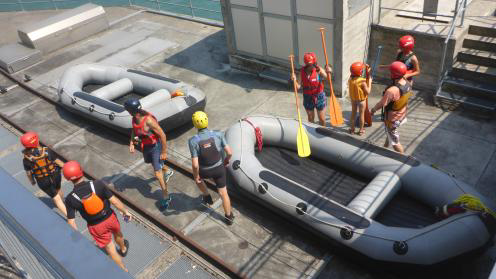
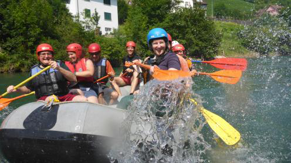
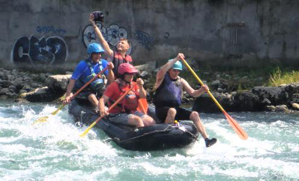
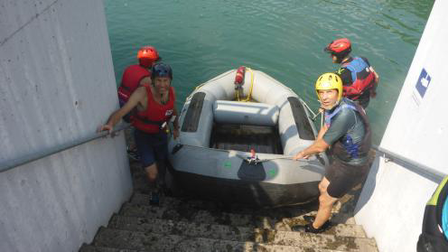
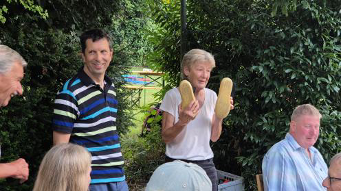
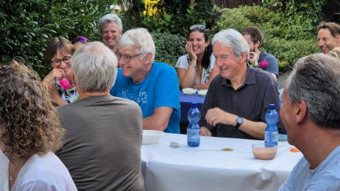
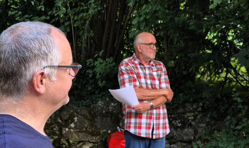
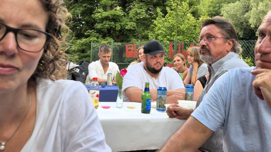
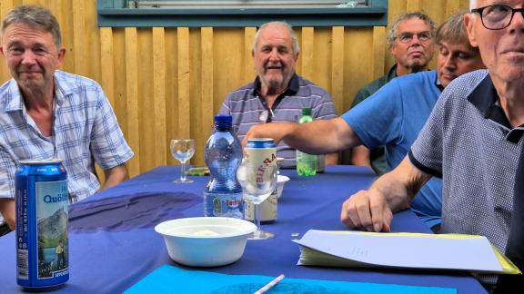
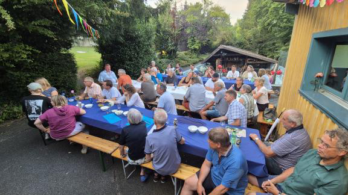

Ja, es ist war: Den Kanu Club Limmat gibt es bereits seit 50 Jahren. Ein halbes Jahrhundert ist ein guter Grund, um ein Jubiläumsfest zu feiern. Begonnen hat alles allerdings schon ein halbes
Jahr zuvor. An der GV stellte sich Alessandra dankenswerterweise als OK – Präsidentin zur Verfü
gung.

Sie richtete eine WhatsApp – Gruppe für die Helfer ein und stellte in übersichtlichen Online isten sorgfältig zusammen, was ein solches Projekt erfordert. Beim Rahmenprogramm setzten wir auf bewährtes: etwas mit unserem Element Wasser (eine Schlauchbootfahrt), ein Apéro, ein Grillabend und natürlich viel Raum, um Erinnerungen austauschen.

Ab Ende Mai wurde es langsam ernst. Nach dem Dienstagstraining besprachen wir regelmässig die noch offenen Punkte, und Berni erzählte uns von einem Fotoalbum, welches er bereits plante. Die Vorfreude wuchs. Unmittelbar vor dem Fest gab es noch einmal viel zu tun: Getränke und Lebensmittel organisieren, den Apéro vorbereiten und im Hochsommer kühl
halten, Tische aufstellen und die Dekoration anbringen. Auch die Rafts mussten bei Heinz Trach
sel in Brugg abgeholt und in der Aue in Stephans Garage vorbereitet werden – zum Glück, denn
eines hatte tatsächlich ein Loch!

Dann war es endlich so weit. Samstag, 13:00 Uhr: Treffpunkt für alle, welche sich für die River- Rafting- Tour angemeldet hatten. Pünktlich trafen die ersten Teilnehmenden ein, und schon bald waren alle 20 Wasserratten versammelt. Umziehen im Chrotte, Fahrt in die Aue, die Boote
fertig aufpumpen und alle mit einem Gütterli Mineralwassser ausgerüsten – dann konnte es losgehen. Eingestiegen sind wir beider Schleuse: zwei 8erund ein 4er Raft. Auf den ersten paar Metern machten wir uns mit den Booten vertraut. Entlang der Limmatpromenade gab es die ersten kleinen Wellenspritzer, bis uns die Oederlin-Wellen schliesslich so richtig die Wildwas
serfreude spüren liessen. Bis zu dreimal durchfuhren wir diesen Abschnitt. Anschliessend folgte der ruhigste Teil bis zum Kraftwerk Kappelerhof. Dort mussten wir die Boote umtragen, ebenso kurz darauf bei der Stauklappe des Kraftwerks Schiffmühle. Auf den ruhigeren Passagen durften Wasserschlachten oder ein erfrischender Schwumm in der Limmat natürlich nicht fehlen. Zweimal gab es nochmals Action: beim Kraftwerk Turgi und zum Schluss bei der BAG (Turgi). Unten angekommen warteten bereits Helfer, sodass Personen- und Materialtransport effizient abliefen.

Etwas verspätet trafen wir Böötler zum Apéro um 17:00 Uhr ein. Es hatten sich bereits viele Gäste eingefunden, und es gab ein grosses Hallo und Willkommen. Aktive, Passive, Ehemalige, auch Vertreter anderer Clubs mit Angehörigen oder Kindern – schliesslich waren wir 50 Personen. Bevor es zum Nachtessen überging, erzählte René Hasenfratz, wie es vor 50
Jahren zur Gründung kam, und zeigte eine Tafel, auf der die damalige Arealplanung dargestellt
ist. Sie lässt sich im Aufenthaltsraum besichtigen. Anschliessend richtete ich als Präsident einige Worte an die Gäste. In meinem ersten Amtsjahr hatten wir das 25-Jahr-Jubiläum gefeiert, und ich erinnerte daran, was sich seither im Clubleben verändert hat – sowohl auf
als auch neben der Limmat. Danach wurden diehungrigen Mäuler gestopft: Es gab Grilladen
und Salate, später Desserts. Mit dem Eindunkeln zeigten wir einige alte Filme aus den Anfangszeiten des Clubs. 50 Jahre, 50 Teilnehmende – ein schönes Bild. Was die Zukunft bringt,
wird sich zeigen; schliesslich ist die „alte Garde“ inzwischen in einem fort-geschrittenen Alter …
Aber man soll die Feste feiern, wie sie fallen, und an diesem Tag habe ich nur fröhliche Gesichter gesehen. An dieser Stelle möchte ich allen herzlich danken, die auf die eine
oder andere Weise zum wundervollen Gelingen dieses Jubiläums beigetragen haben.

Vielen Dank!
